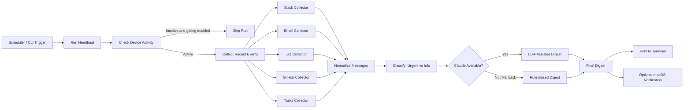

# Heartbeat

> A lightweight founder digest engine that collects recent updates from multiple work systems and turns them into a short, actionable heartbeat every 30 minutes.

## Project Title

**Heartbeat: Founder Digest Automation**

## Problem Statement

Founders and operators often receive updates across Slack, email, GitHub, Jira, and internal task trackers. The problem is not a lack of information, but fragmented attention. Important requests, blockers, approvals, and customer escalations can easily get buried under low-signal operational noise.

In a fast-moving business environment, leadership needs a reliable way to answer one question repeatedly:

**What do I need to know right now, and what needs my action before the next 30-minute check-in?**

## Solution Overview

Heartbeat is a Python-based digest runner designed to solve that problem. It periodically:

- collects recent activity from connected systems
- normalizes events into a common internal format
- classifies items as urgent or informational
- summarizes the result into a short digest
- prints the digest locally and optionally triggers a macOS notification

The system supports both:

- **demo / fallback mode**, where collectors return dummy data for local testing
- **live mode**, where collectors use real credentials from environment variables

This makes the project practical for demos, local development, and gradual rollout into real workflows.

## System Design / Architecture

Heartbeat follows a simple modular pipeline:

1. **Collectors** fetch events from each source system.
2. **Processing** normalizes, classifies, and summarizes updates.
3. **Delivery** prints the digest and optionally triggers a local notification.
4. **Scheduler** runs the workflow once or on a recurring interval.

### Architectural Principles

- **Separation of concerns**: collection, processing, and delivery are isolated into separate modules.
- **Graceful degradation**: if credentials are missing or an integration is unavailable, the application falls back safely instead of crashing.
- **LLM optionality**: Claude can be used when available, but the project remains functional with rule-based summarization.
- **Operator-friendly execution**: can run as a simple local script without requiring deployment infrastructure.

## Flowchart



## Modules / Features

### Core Features

- **Multi-source collection**
  - Slack channel activity
  - IMAP email messages
  - Jira issues
  - GitHub issues / PR signals
  - internal task-style updates

- **Founder-focused prioritization**
  - separates urgent requests from informational updates
  - highlights blockers, approvals, deadlines, and response-needed items

- **Digest quality controls**
  - splits large pasted Slack blocks into separate digest items
  - filters low-signal Slack system noise such as join/leave events
  - deduplicates repeated lines
  - caps digest length to remain readable

- **Resilient runtime behavior**
  - supports dummy fallback data for testing
  - falls back to rule-based summarization when Claude is unavailable
  - continues operating even if some integrations fail

- **Local operator experience**
  - one-shot validation mode
  - recurring scheduled mode
  - optional macOS notification support

## Tech Stack

- **Language**: Python 3.9+
- **Scheduling**: `schedule`
- **HTTP integrations**: `requests`
- **LLM integration**: `anthropic`
- **Environment management**: `python-dotenv`
- **Notifications**: macOS local notification workflow

## Installation & Setup

### 1. Clone the repository

```bash
git clone https://github.com/Nishkarsh0Sharma/heartbeat.git
cd heartbeat
```

### 2. Create and activate a virtual environment

```bash
python3 -m venv venv
source venv/bin/activate
```

### 3. Install dependencies

```bash
pip install -r requirements.txt
```

### 4. Configure environment variables

Create a local `.env` file in the project root.

Example:

```env
HEARTBEAT_INTERVAL_MINUTES=30
HEARTBEAT_NOTIFICATION_ENABLED=false
HEARTBEAT_LLM_PROVIDER=mock

SLACK_BOT_TOKEN=your_slack_bot_token
GITHUB_TOKEN=your_github_token
GITHUB_USERNAME=your_github_username

JIRA_BASE_URL=https://your-domain.atlassian.net
JIRA_EMAIL=you@example.com
JIRA_API_TOKEN=your_jira_token

IMAP_HOST=imap.gmail.com
IMAP_USER=you@gmail.com
IMAP_PASS=your_app_password

ANTHROPIC_API_KEY=your_claude_key
```

### 5. Optional environment variable aliases

Heartbeat supports multiple credential aliases:

- Claude: `ANTHROPIC_API_KEY` or `CLAUDE_API_KEY`
- GitHub token: `GITHUB_TOKEN` or `GH_TOKEN` or `GITHUB_PAT`
- GitHub user: `GITHUB_USERNAME` or `GITHUB_USER`
- IMAP user: `IMAP_USER` or `IMAP_EMAIL` or `GMAIL_USER` or `GMAIL_EMAIL`
- IMAP password: `IMAP_PASS` or `IMAP_PASSWORD` or `GMAIL_APP_PASSWORD`
- IMAP host: `IMAP_HOST` or `GMAIL_IMAP_HOST`

## Usage

### Run once

Use this to validate configuration or test the latest digest output.

```bash
./venv/bin/python main.py --once
```

### Run continuously

```bash
./venv/bin/python main.py
```

### Override interval

```bash
./venv/bin/python main.py --interval-minutes 15
```

### Expected terminal output

```text
Running heartbeat...
Summarizer: Claude
Summarizer: rule-based (Claude unavailable: BadRequestError)

===== DIGEST =====
- [URGENT] all-heartbeat-bot (slack): IMPORTANT: Client ABC Pharma is waiting on founder approval...
- [INFO] GitHub (github): GitHub connected, but no open issues or PRs matched the current filters.
```

### API request examples

This repository is currently **CLI-first** and does **not** expose an HTTP server out of the box. However, if you wrap Heartbeat behind a service layer, the following API contract is a practical industry-style interface for external triggers and UI integrations.

#### `POST /api/v1/digest/run`

Trigger a one-time digest generation.

**Request**

```http
POST /api/v1/digest/run
Content-Type: application/json
```

```json
{
  "lookback_minutes": 30,
  "require_active": true,
  "notification_enabled": false,
  "sources": ["slack", "email", "jira", "github", "tasks"]
}
```

**Response**

```json
{
  "status": "success",
  "mode": "rule-based",
  "digest": [
    {
      "priority": "urgent",
      "source": "slack",
      "client": "ABC Pharma",
      "message": "Approval needed on revised pricing before EOD."
    },
    {
      "priority": "info",
      "source": "github",
      "client": "platform/api",
      "message": "GitHub connected, but no open issues or PRs matched the current filters."
    }
  ]
}
```

#### `GET /api/v1/health`

Return service health and summarizer mode.

**Request**

```http
GET /api/v1/health
```

**Response**

```json
{
  "status": "ok",
  "scheduler": "running",
  "summarizer_provider": "claude",
  "fallback_enabled": true
}
```

#### `GET /api/v1/integrations/status`

Return current integration readiness.

**Request**

```http
GET /api/v1/integrations/status
```

**Response**

```json
{
  "slack": {
    "connected": true,
    "mode": "live"
  },
  "github": {
    "connected": true,
    "mode": "live"
  },
  "jira": {
    "connected": false,
    "mode": "fallback"
  },
  "email": {
    "connected": false,
    "mode": "fallback"
  }
}
```

## Folder Structure

```text
heartbeat/
├── collectors/
│   ├── slack_collector.py
│   ├── email_collector.py
│   ├── jira_collector.py
│   ├── github_collector.py
│   └── tasks_collector.py
├── processing/
│   ├── classifier.py
│   ├── digest.py
│   └── summarizer.py
├── delivery/
│   └── notifier.py
├── llm/
│   └── claude_client.py
├── utils/
│   └── activity.py
├── config.py
├── main.py
├── requirements.txt
└── README.md
```

## Future Improvements

- add a proper HTTP / FastAPI wrapper for remote triggering and dashboards
- store digest history for audit and trend analysis
- improve urgency scoring with ranking instead of simple keyword matching
- collapse related Slack items into grouped summaries
- add tests for collectors, classification, and formatting
- add source-specific filtering rules and channel-level controls
- support outbound delivery to Slack, email, or mobile push

## Contributing Guidelines

Contributions are welcome.

### Recommended workflow

1. Fork the repository
2. Create a feature branch
3. Make focused changes with clear commit messages
4. Test locally using `./venv/bin/python main.py --once`
5. Open a pull request with:
   - summary of changes
   - testing notes
   - screenshots or output snippets if behavior changed

### Contribution expectations

- keep modules small and responsibility-focused
- avoid hardcoding secrets or environment-specific values
- preserve fallback behavior when live integrations fail
- document any new configuration in `README.md`

## License

This repository does not currently include a license file.

If you plan to make the project publicly reusable, add a standard open-source license such as **MIT** or **Apache-2.0**.
